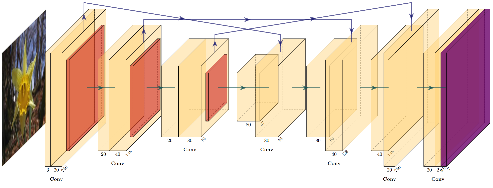

# Flower Segmentation with U-Nets and ResNets

# Info

This project is a look into segmenting a flower dataset using two deep-learning U-Nets, one trained from scratch, and the other from an existing ResNet network.

# Report and Release

The Release folder contains the finished code for both U-Nets in MATLAB, and the Report folder contains the written report about the codes performance and methodology.

